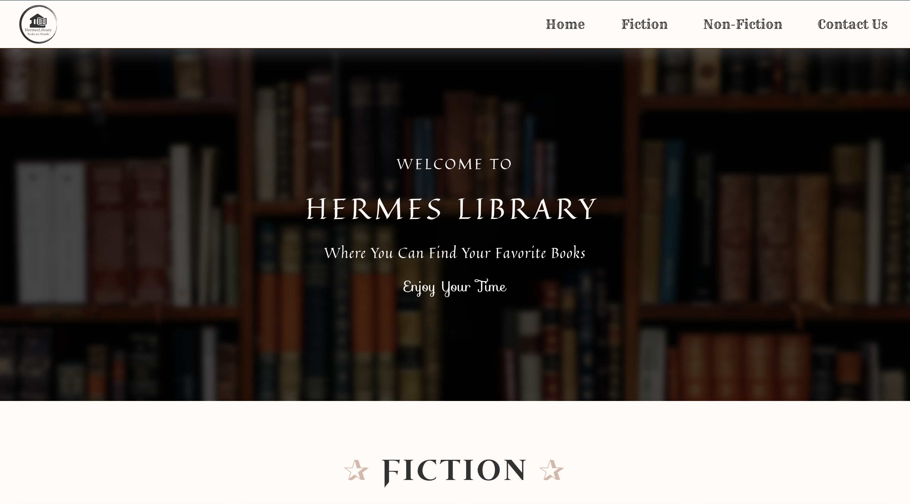

<a name="readme-top"></a>
[](https://www.linkedin.com/in/nhung-tran-528396210/)
[](https://discord.com/users/619924502226141225)
[](https://www.facebook.com/rinkaki.toran/)

<!-- PROJECT LOGO -->
<br />
<div align="center">
  <a href="https://github.com/othneildrew/Best-README-Template">
    
  </a>
  <h1 align="center">Hermes Library Project</h1>
  <h3 style="font-weight: 300;">Bridging Book Lovers Worldwide</h3>

  <p align="center">
    <a href="https://hermes-library.netlify.app/">View Online</a>
    ---
    <a href="https://github.com/Puppychan/HermesLibrary">View Repository</a>
  </p>
</div>

<!-- TABLE OF CONTENTS -->
<details>
  <summary>Table of Contents</summary>
  <ol>
    <li>
      <a href="#about-the-project">About The Project</a>
      <ul>
        <li><a href="#built-with">Built With</a></li>
      </ul>
    </li>
    <li>
      <a href="#getting-started">Getting Started</a>
      <ul>
        <li><a href="#prerequisites">Prerequisites</a></li>
        <li><a href="#installation">Installation</a></li>
      </ul>
    </li>
    <li><a href="#usage">Usage</a></li>
    <li><a href="#roadmap">Roadmap</a></li>
    <li><a href="#contributing">Contributing</a></li>
    <li><a href="#contact">Contact</a></li>
    <li><a href="#acknowledgments">Acknowledgments</a></li>
  </ol>
</details>

<!-- ABOUT THE PROJECT -->

## About The Project



The website 'Hermes Library Website' is a book trading website. Using this website, the users can find and buy their books, or selling if they want to sell their books. The main purposes of this website is to bring the books globally, so that the book lovers can reach and exchange the books from anywhere and anytime they want. 
<br><br>
However, this project concentrates on frontend instead of developing backend. The primary purpose of buiding this project is to reinforce the knowledge of html, and plain css, especially styling responsive and animation in this website. Besides, this project aims to let the coders understand the importance of using javascript and dynamic program in developing the website.
<br>
<h3>Scope</h3>
The general scope of this project is users can view the list of categorized books. For each books, they can also explore details 


Here's why:

- Your time should be focused on creating something amazing. A project that solves a problem and helps others
- You shouldn't be doing the same tasks over and over like creating a README from scratch
- You should implement DRY principles to the rest of your life :smile:

Of course, no one template will serve all projects since your needs may be different. So I'll be adding more in the near future. You may also suggest changes by forking this repo and creating a pull request or opening an issue. Thanks to all the people have contributed to expanding this template!

Use the `BLANK_README.md` to get started.

<p align="right">(<a href="#readme-top">back to top</a>)</p>

### Built With

Because this is a simple project for practing stying css, and understanding the importance of javascript, this project only uses html, css, and some javascript for some effects. There is no backend tools, frameworks, languages used in this project.

- 
- 
- 

<p align="right">(<a href="#readme-top">back to top</a>)</p>
todo:
- Change embed content
- Add header comment
- Change references style inside each file
- Check html tag
- 

<!-- GETTING STARTED -->

## Getting Started

This is a simple frontend project, so there is no prerequisites for running this project.

### Prerequisites

None
### Installation

To install the app

1. Clone the repo
   ```sh
   git clone https://github.com/Puppychan/HermesLibrary
   ```
2. Install live server extension on Visual Studio Code

<p align="right">(<a href="#readme-top">back to top</a>)</p>

<!-- USAGE EXAMPLES -->

## Usage

Use this space to show useful examples of how a project can be used. Additional screenshots, code examples and demos work well in this space. You may also link to more resources.

_For more examples, please refer to the [Documentation](https://example.com)_

<p align="right">(<a href="#readme-top">back to top</a>)</p>

<!-- ROADMAP -->

<!-- CONTACT -->

## Contact

Tran Mai Nhung - [Matsuri's Discord](https://www.linkedin.com/in/nhung-tran-528396210/) - nhungmaitran1412@gmail.com

Project Link: [https://github.com/Puppychan/HermesLibrary](https://github.com/Puppychan/HermesLibrary)

Demo Link: [https://hermes-library.netlify.app/copyright](https://hermes-library.netlify.app/copyright)

<p align="right">(<a href="#readme-top">back to top</a>)</p>

<!-- ACKNOWLEDGMENTS -->

## Acknowledgments

Use this space to list resources you find helpful and would like to give credit to. I've included a few of my favorites to kick things off!

- Detailed Acknowledgement is inside each code file.

<p align="right">(<a href="#readme-top">back to top</a>)</p>

