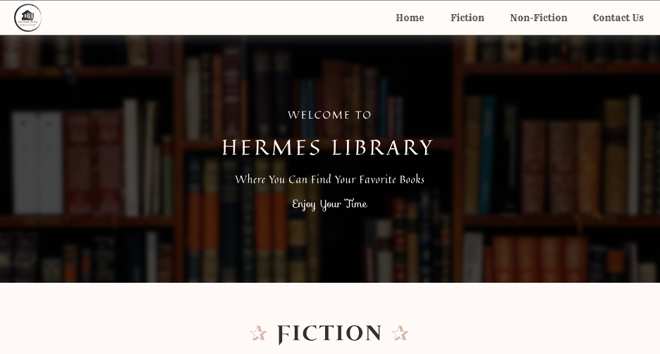
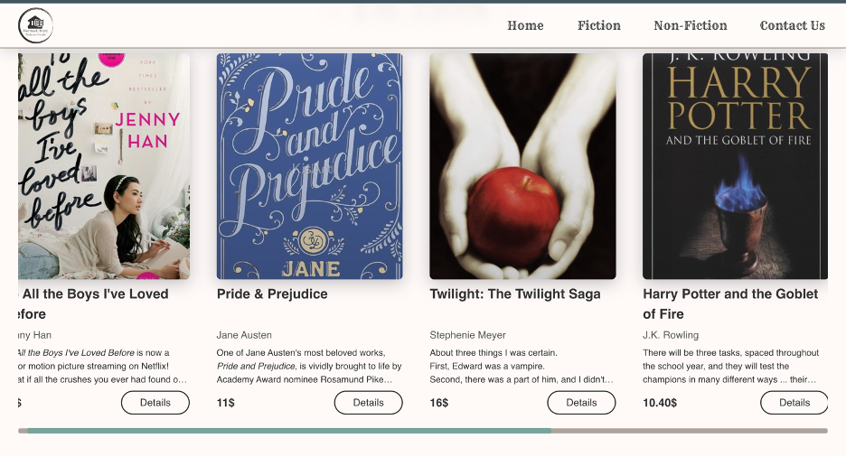
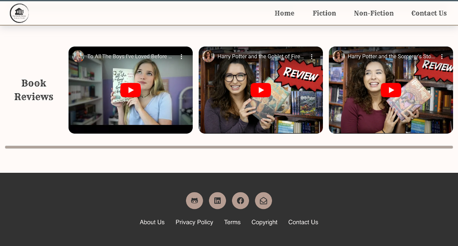
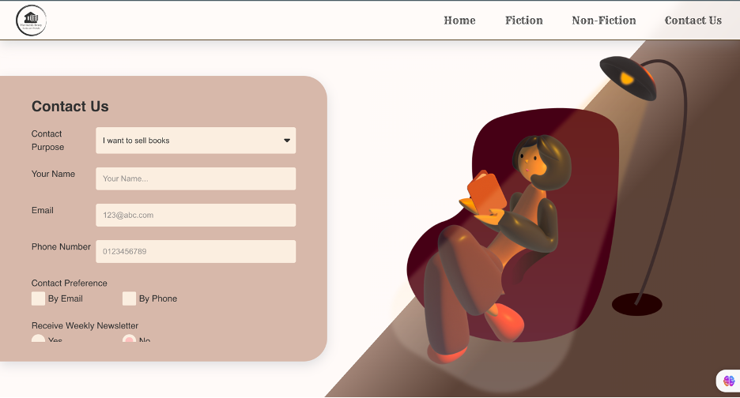
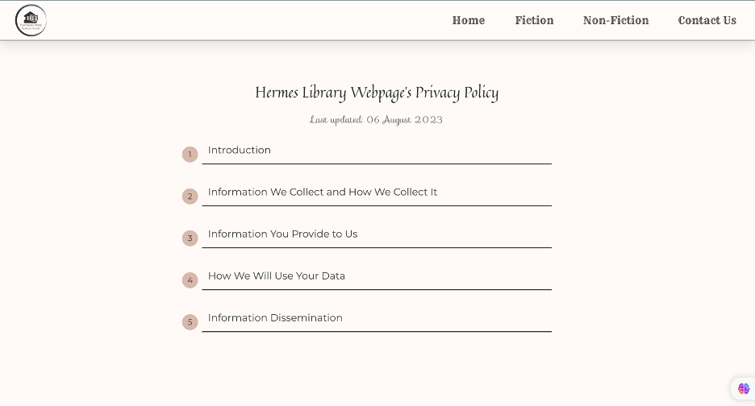
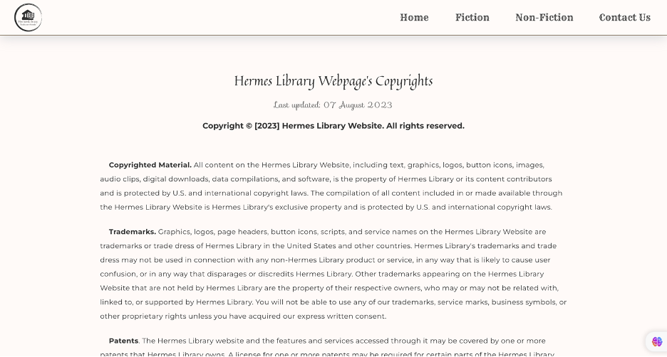

<a name="readme-top"></a>
[](https://www.linkedin.com/in/nhung-tran-528396210/)
[](https://discord.com/users/619924502226141225)
[](https://www.facebook.com/rinkaki.toran/)

<!-- PROJECT LOGO -->
<br />
<div align="center">
  <a href="https://github.com/othneildrew/Best-README-Template">
    
  </a>
  <h1 align="center">Hermes Library Project</h1>
  <h3 style="font-weight: 300;">Bridging Book Lovers Worldwide</h3>

  <p align="center">
    <a href="https://puppychan.github.io/HermesLibrary/">View Online</a>
    ---
    <a href="https://github.com/Puppychan/HermesLibrary">View Repository</a>
  </p>
</div>

<!-- TABLE OF CONTENTS -->
<details>
  <summary>Table of Contents</summary>
  <ol>
    <li>
      <a href="#about-the-project">About The Project</a>
      <ul>
        <li><a href="#built-with">Built With</a></li>
      </ul>
    </li>
    <li>
      <a href="#getting-started">Getting Started</a>
      <ul>
        <li><a href="#prerequisites">Prerequisites</a></li>
        <li><a href="#installation">Installation</a></li>
      </ul>
    </li>
    <li><a href="#usage">Usage</a></li>
    <li><a href="#roadmap">Roadmap</a></li>
    <li><a href="#contributing">Contributing</a></li>
    <li><a href="#contact">Contact</a></li>
    <li><a href="#acknowledgments">Acknowledgments</a></li>
  </ol>
</details>

<!-- ABOUT THE PROJECT -->

## About The Project


The website 'Hermes Library Website' is a book trading website. Using this website, the users can find and buy their books, or selling if they want to sell their books. The main purpose of this website is to bring the books globally, so that the book lovers can reach and exchange the books from anywhere and anytime they want.
<h3>Scope</h3>
Technically, this project concentrates on frontend instead of developing backend. The primary purpose of buiding this project is to reinforce the knowledge of html, and plain css, especially styling responsive and animation in this website. Besides, this project aims to let the coders understand the importance of using javascript and dynamic program in developing the website. Finally, this project aims to help the web coders who are in beginner level improve their CSS skills and using tags inside HTML file. After this project, they are expected to be able to write CSS and HTML fluently and understanding clearly why applying JavaScript to web programming.<br>
In this project, there are several requirements, including using plain HTML and CSS to style and add animation, having responsive design, having 4 compulsory types of pages with specific requirements for each page, et cetera.  Therefore, in this project, for Home, Category, there are book list displayed to the users categorized following its category. On the other hand, in Book Detail page, the users can view the book information in details with images and description. In Contact page, there is a form to input the contact information if the users want to buy or sell books. In other pages, including About, Privacy, Terms, and Copyrights, the users can understand clearler about the webite company and its policy. Finally, all pages are styled with animation when hovering, and include responsive design – mobile, tablet, and desktop..<br>
However, because the objectives of this project concentrate on the improvement of using HTML and CSS, there is no backend for this project. In other words, the users can only view the book list, the Contact form information will not be sent to the client. And all `Add to cart` buttons in Detail page will only display a message modal. The main resources in this project are HTML, CSS, and some JavaScript for animation control. .<br>
This project lasts for 4 weeks. The first week is for researching, the second week is for designing, and two final weeks are for implementing this project.


<p align="right">(<a href="#readme-top">back to top</a>)</p>

### Built With

Because this is a simple project for practing stying css, and understanding the importance of javascript, this project only uses html, css, and some javascript for some effects. There is no backend tools, frameworks, languages used in this project.

- 
- 
- 

Images Hosting Resource: [imgbox.com](https://imgbox.com/)

<p align="right">(<a href="#readme-top">back to top</a>)</p>
todo:
- Check html tag

<!-- GETTING STARTED -->

## Getting Started

This is a simple frontend project, so there is no prerequisites for running this project.

### Prerequisites

None
### Installation

To install the app

1. Clone the repo
   ```sh
   git clone https://github.com/Puppychan/HermesLibrary
   ```
2. Install live server extension on Visual Studio Code

<p align="right">(<a href="#readme-top">back to top</a>)</p>

<!-- DEMO -->
<!-- 









 -->

<!-- CONTACT -->

## Contact

Tran Mai Nhung - [Matsuri's Discord](https://www.linkedin.com/in/nhung-tran-528396210/) - nhungmaitran1412@gmail.com

Project Link: [https://github.com/Puppychan/HermesLibrary](https://github.com/Puppychan/HermesLibrary)

Demo Link: [https://puppychan.github.io/HermesLibrary/](https://puppychan.github.io/HermesLibrary/)

<p align="right">(<a href="#readme-top">back to top</a>)</p>

<!-- ACKNOWLEDGMENTS -->

## Acknowledgments

- Detailed Acknowledgement is inside each code file.

<p align="right">(<a href="#readme-top">back to top</a>)</p>

